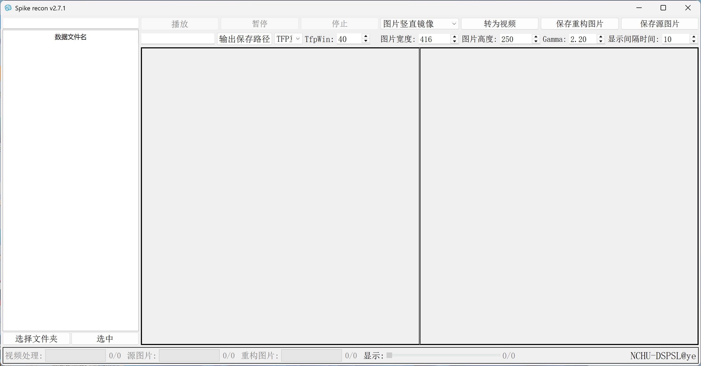

# spike_recon

#### 介绍
脉冲数据重构软件。

#### 功能
* 支持自定义图像分辨率
* 支持操作多个脉冲数据文件
* 支持TFP、TFI重构算法
* 支持导出重构图像、导出视频
* 支持通过滑块单张图像显示

#### 软件架构
1. 使用qt 5.14框架
2. cmake管理工程

### 下载地址
[蓝奏云](https://wwzy.lanzoue.com/itwv52h7lt6d)

